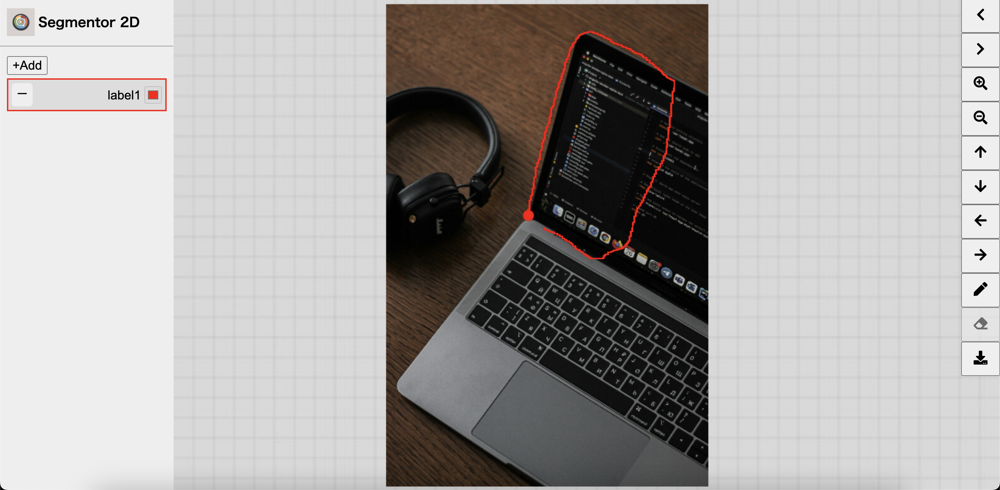

# Segmentor 2D

This repository provides a web application for image segmentation, designed to prepare 2D annotated images for training semantic segmentation models.
However, as a segmentation tool, it does not yet offer a wide range of convenient features and remains quite basic.

## Features
- Support for multiple images
- Adding mutiple labels / deleting existing labels
- Pen / eraser tool
- Download as .png image

## Note
It is currently not possible to load and edit pre-masked images. This feature is planned to be added in the future.

## Installation
NPM have to be possible to use. Using it, dependency libraries have to be installed as node modules.
```
npm i
```

## Run
```
npm run dev
```

You can access to `http://localhost:5173/`



## Usage
1. Add the images you want to annotate to the public/dataset/images directory.
2. Add a label using the +add button on the left.
3. Enter any label name and select the color you want to use.
4. Once a label is added, click on the label to select it.
5. Click on any area of the image where you want to draw and move the mouse. The area will be colored with a transparent fill starting from the point you clicked.
6. If you want to erase part of the annotated area, select the eraser from the tools on the right.
7. You can download a annotation image as PNG by clicking on download button on the right.

## Tips
- You can move the image while drawing by holding Shift and dragging with the left mouse button.
- You can zoom in and out of the image using Ctrl + Scroll.

## Feedback
If you have any requests or issues, please feel free to open an issue. Thank you for your attention!


